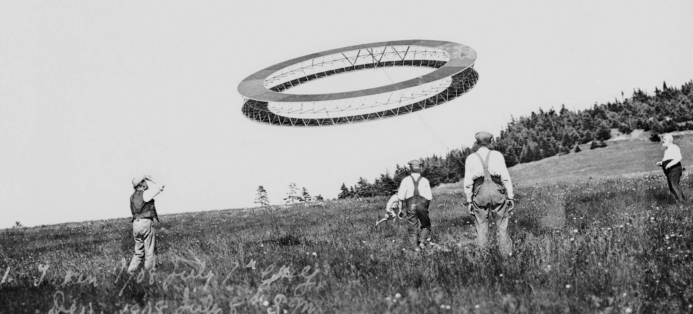

# CCOODDEESS

Hello 🌎, and welcome to my coding portfolio! 👋

If you'd like to see some walkthroughs and screenshots, head over to [https://ggeerraarrdd.github.io/](https://ggeerraarrdd.github.io/)!

## Index

### 🎛️ Application Programming

* [`Geofinder`](https://github.com/ggeerraarrdd/geofinder) – an online game that's like "Where's Waldo?" but for houses
* [`Portfoliofy`](https://github.com/ggeerraarrdd/portfoliofy) – a RESTful API to generate portfolio-ready screenshots of your awesome web projects
* [`Landscape Architecture Film Series`](https://github.com/ggeerraarrdd/film-series) - an early aughts basic website recreated with modern tools
* [`LAFSCMS`](https://github.com/ggeerraarrdd/lafs-cms) - a bespoke CMS for the film series website
* [`VRTechnologies`](https://github.com/ggeerraarrdd/vacation) - an Information System for data sourcing, data quality assurance and business intelligence
* [`Shelfie!`](https://github.com/ggeerraarrdd/shelfie) - a library management system using TKinter in Python

### 📊 Analytical Programming

* [`Camp Data`](https://github.com/ggeerraarrdd/geofinder) — a repository of Jupyter notebooks for select Python projects from DataCamp

### 🗄️ Database Design and Programming

* [`Public Art API`](https://github.com/ggeerraarrdd/public-art) - a planned data portal for public art in Chicago
* `CS452` — a repository of solutions to problem sets in a graduate course in Database Programming _(not public; available upon request)_

### 🌱 More

* [`SQL Everyday`](https://github.com/ggeerraarrdd/sql-everyday) - solving one SQL problem a day for a year

## 📫 Let's connect

* [LinkedIn](https://www.linkedin.com/in/gerardbullalayao/)

## Fron­tispiece

Alexander Graham Bell, "Alexander Graham Bell (right) and His Assistants Observing the Progress of One of His Tetrahedral Kites," photograph, July 7, 1908, Library of Congress Prints and Photographs Division, <http://hdl.loc.gov/loc.pnp/pp.print>. _([Source](https://www.loc.gov/pictures/collection/cph/item/00650258/))_
