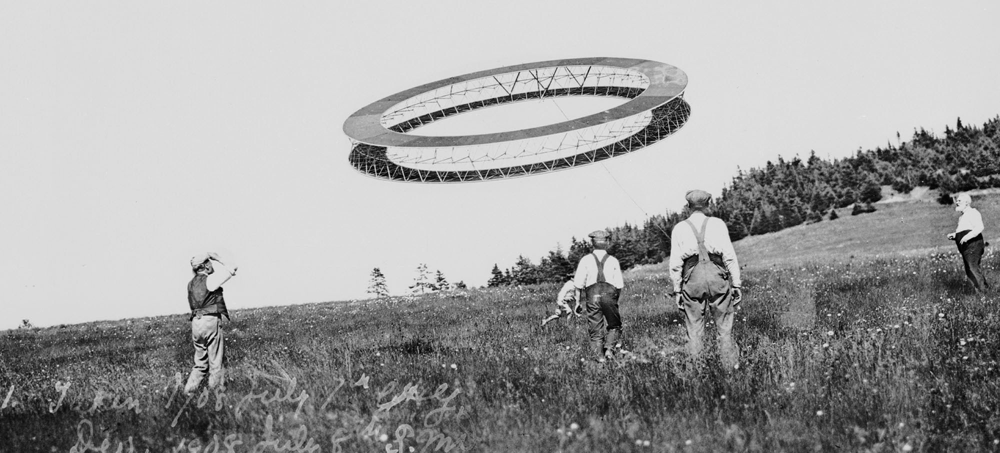

# CCOODDEESS

Hello 🌎, and welcome to my coding portfolio! 👋

Below is an `Index` of select projects from my graduate studies in [Computer Science @ DePaul University](https://www.cdm.depaul.edu/academics/Pages/MS-in-Computer-Science.aspx) and from extracurricular activities elsewhere.

If you'd like to see some walkthroughs and lots of screenshots, check out my [Portfolio Website @ ggeerraarrdd.github.io](https://ggeerraarrdd.github.io/).

## 🎛️ Index

* [`Geofinder`](https://github.com/ggeerraarrdd/geofinder) - an online game that's like "Where's Waldo?" but for houses
* [`Portfoliofy`](https://github.com/ggeerraarrdd/portfoliofy) - a RESTful API to generate portfolio-ready screenshots of your awesome web projects
* [`LAFS-DEV`](https://github.com/ggeerraarrdd/lafs-dev) - an early aughts basic website turned modern dev playground for front-end and back-end skill building
  * [`LAFS`](https://github.com/ggeerraarrdd/lafs) - a digital archive for a Landscape Architecture Film Series website from the early aughts
* [`VRTechnologies`](https://github.com/ggeerraarrdd/vacation) - an Information System for data sourcing, data quality assurance and business intelligence
* [`Shelfie!`](https://github.com/ggeerraarrdd/shelfie) - a library management system using TKinter in Python
* [`Public Art API`](https://github.com/ggeerraarrdd/public-art) - a data portal for public art in Chicago

## 📅 The eevveerryyddaayy Project

* [`eevveerryyddaayy-template`](https://github.com/ggeerraarrdd/eevveerryyddaayy-template) and [`eevveerryyddaayy`](https://github.com/ggeerraarrdd/eevveerryyddaayy) - a Github template repository and its documentation for tracking daily technical skill-building challenges
* [`SQL Everyday`](https://github.com/ggeerraarrdd/sql-everyday) - solving one SQL problem a day for a year

## 📫 Let's connect

* [LinkedIn](https://www.linkedin.com/in/gerardbullalayao/)

## Frontispiece

Alexander Graham Bell, "Alexander Graham Bell (right) and His Assistants Observing the Progress of One of His Tetrahedral Kites," photograph, July 7, 1908, Library of Congress Prints and Photographs Division, <http://hdl.loc.gov/loc.pnp/pp.print>. _([Source](https://www.loc.gov/pictures/collection/cph/item/00650258/))_
